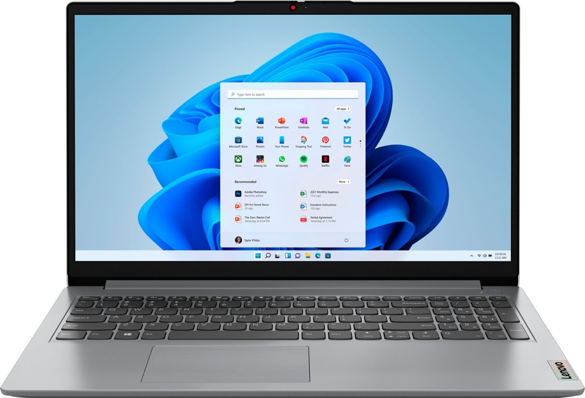
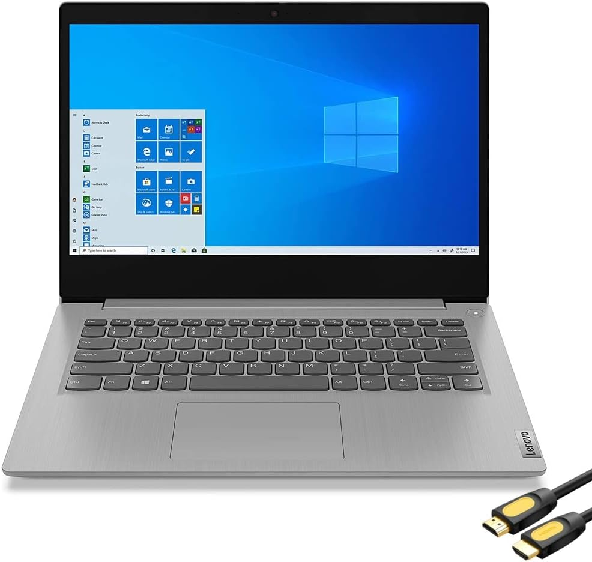
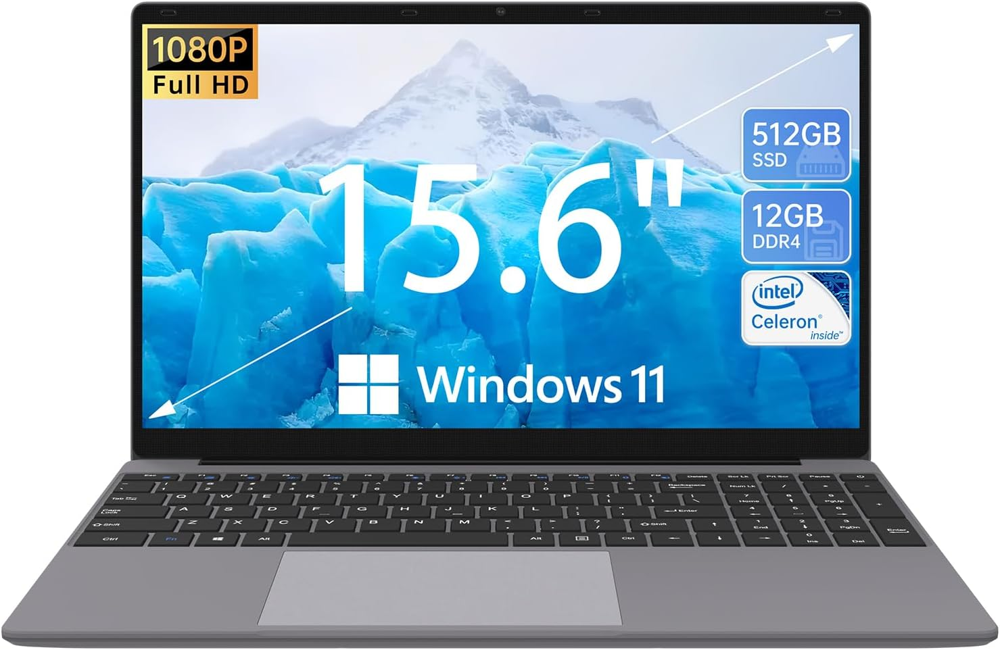

PROMPT=$'%{$fg[white]%}$(ruby_prompt_info) %{$fg_bold[cyan]%}%~%{$reset_color%}$(git_prompt_info) %{$fg[cyan]%}%D{[%I:%M:%S]}\
%{$fg_bold[green]%}%n$%{$reset_color%} '

ZSH_THEME_GIT_PROMPT_PREFIX=" %{$fg[white]%}("
ZSH_THEME_GIT_PROMPT_SUFFIX=")%{$reset_color%}"
ZSH_THEME_GIT_PROMPT_DIRTY="*"
ZSH_THEME_GIT_PROMPT_CLEAN=""# CFO
This is a recommendation page for CFO laptops

## Laptop Option 1: [Lenovo Athlon Silver](https://www.bestbuy.com/site/lenovo-ideapad-1-15-6-hd-laptop-athlon-silver-7120u-with-4gb-memory-128gb-ssd-cloud-grey/6531746.p?skuId=6531746)

**Primary Resources:**
- CPU Model: [AMD Athlon]
- Number of Processor: [AMD Athlon Silver 7120U]
- RAM: [4 GB]
- Hard Drive Storage: [128 GB]

## Laptop Option 2: [Lenovo IdeaPad 3i ](https://www.amazon.com/Lenovo-IdeaPad-Business-Student-i3-1115G4/dp/B0BSR6N4WY/ref=sr_1_2_sspa?crid=31ZBEMBLDQUC1&keywords=lenovo+laptop&qid=1689560155&refinements=p_n_feature_thirty-three_browse-bin%3A23720419011&rnid=23720416011&s=pc&sprefix=lenovo+%2Caps%2C196&sr=1-2-spons&sp_csd=d2lkZ2V0TmFtZT1zcF9hdGY&psc=1)

**Primary Resources:**
- CPU Model: [Core i3]
- Number of Processor: [3 GHz core_i3]
- RAM: [8 GB DDR4]
- Hard Drive Storage: [512 GB]

## Laptop Option 3: [ApoloSign](https://www.amazon.com/dp/B0C3LNNRJS?tag=track-ect-usa-1224787-20&linkCode=osi&th=1&psc=1)

**Primary Resources:**
- CPU Model: [Celeron]
- Number of Processors: [2.8 MHz celeron]
- RAM: [12 GB]
- Hard Drive Storage: [512 GB ] 
**Reasons to Consider Apolosign:**
1. High Performance and Efficiency: Apolosign features a powerful CPU with a high benchmark score, offering exceptional performance for demanding tasks and multitasking.
2. Full HD Display: Apolosign comes with a full HD display, providing sharp and vibrant visuals for enhanced viewing experience.
3. Versatile Connectivity: Apolosign offers a wide range of connectivity options, including USB-C, HDMI, and multiple USB ports, allowing for seamless connectivity with various devices.

## Overall Recommendation
Based on the comparison, I recommend **Option 3: Apolosign** as the ideal choice for the organization's laptop procurement. It combines high performance, a full HD display, versatile connectivity options, and falls within the specified budget. I have to emphasize the ram and the massive 512 GB of storage you are getting at this price. That in my opion makes this laptop the best option for the job. The speed and reliablity is unmatched compared to the options on the list provided.
